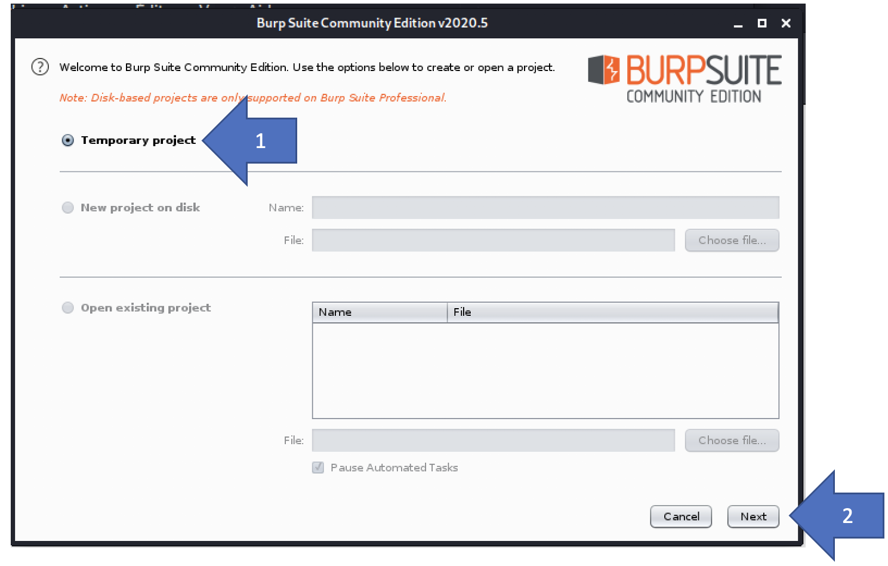
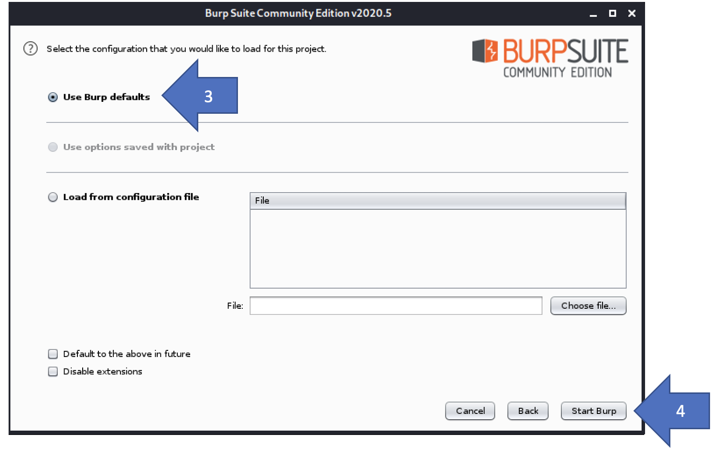

# Comment faire un document d'aide  

## Étape 1 : Captures d'écran  

- Prendre des captures d'écran de chaque étape de la procédure.  
- Prendre la fenêtre de l'application au complet.  
- Masquer les informations personnelles (nom, adresse courriel, etc.)  

## Étape 2 : Annoter les captures d'écran  

- Utiliser un logiciel de dessin pour ajouter des flèches numérotées représentant les étapes de la procédure.  
- Assurez vous que les numéros sont dans le bon ordre et que la numérotation est continue pour tout le document.  

## Étape 3 : Ajouter du texte

- Ajouter du texte pour expliquer les étapes.  

# Exemple  

Attaque avec une force brute

Certaines application Web sont susceptibles à une attaque par force brute. Pour démontrer comment faire une telle attaque, nous allons utiliser BurpSuite.

## Démarrer BurpSuite

### Créer un projet temporaire  

  

1- Sélectionnez « temporary project »  
2- Cliquez sur « next »  

## Démarrer le Burp  

  

3- Sélectionnez « Use Burp Defaults »  
4- Cliquez sur « Start Burp »  

